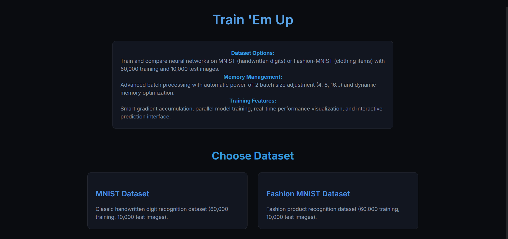
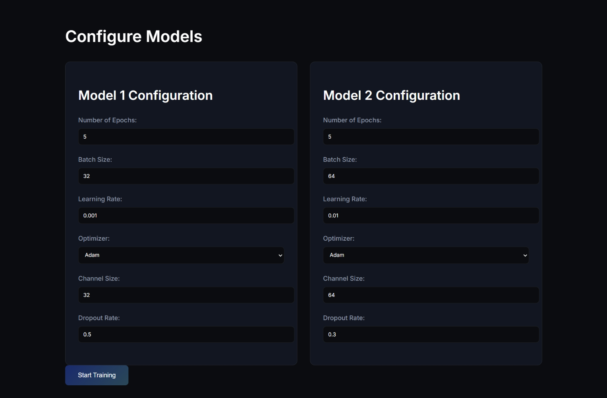
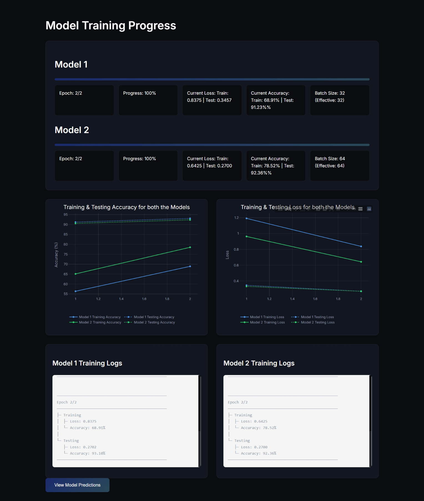
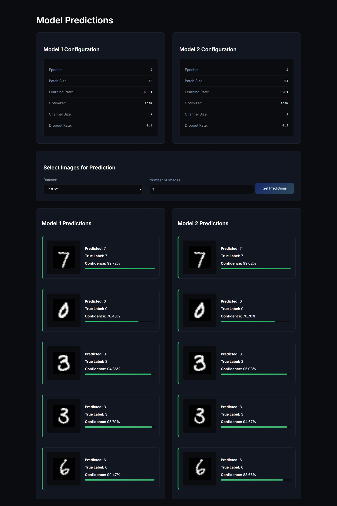

# Neural Network Training Application

## Overview
This application provides an advanced, interactive platform to train and compare neural networks on widely used computer vision datasets. Users can select between MNIST (handwritten digits) and Fashion-MNIST datasets, configure multiple models with tailored hyperparameters, and monitor training progress and predictions in real-time using a user-friendly interface.

---

## Features

### Dataset Selection


- **Supported Datasets**:
  - **MNIST**: Classic dataset of handwritten digits (0-9).
  - **Fashion-MNIST**: Dataset featuring fashion product images in 10 categories.
- **Dataset Composition**:
  - 60,000 training images.
  - 10,000 test images.
  - Uniform 28x28 grayscale images.

---

### Hyperparameter Configuration


- Users can independently configure two models with:
  - **Network Architecture**:
    - Number of channels in convolutional layers.
    - Dropout rates for regularization.
  - **Training Parameters**:
    - Batch size, learning rate, optimizer selection (Adam or SGD), and training epochs.

---

### Channel Optimization
- **Dynamic Channel Progression**:
  - Input channels progressively expand through convolutional layers:
    - `channels → channels*2 → channels*4`.
  - Balances efficient feature extraction with computational efficiency.
- **Memory Optimization**:
  - Dynamically adjusts channel sizes to available memory.
  - Increases model capacity without exceeding memory limits.

---

### Advanced Memory Management
- **Smart Batch Size Calculation**:
  - Automatically determines the maximum batch size based on system memory usage (70% of available RAM).
  - Ensures compatibility with valid power-of-2 sizes (e.g., 4, 8, 16, 32, etc.).
- **Training-Test Consistency**:
  - Dynamically aligns batch sizes between training and testing datasets.

---

### Batch Processing System


- **Dynamic Batch Adjustment**:
  - Adjusts user-requested batch sizes to nearest valid power-of-2 values.
  - Maintains consistent batch sizes across training and testing phases.
- **Gradient Accumulation**:
  - Enables large effective batch sizes by dividing them into smaller memory-friendly steps.
  - Automatically calculates accumulation steps using:
    - `accumulation_steps = ceil(user_batch_size / max_possible_batch_size)`.

---

### Prediction Interface


- **Interactive Predictions**:
  - Predict multiple images from training or test datasets.
  - Visualize results with side-by-side comparisons of predictions from both models.
- **Prediction Details**:
  - Displays original images alongside true labels and confidence scores.
  - Includes label mapping:
    - **MNIST**: Numerical labels (0-9).
    - **Fashion-MNIST**: Category labels (e.g., T-shirt, Trouser).

---

## Technical Implementation

### Batch Size Calculation
The `calculate_max_batch_size` function computes the optimal batch size that fits within system memory constraints:
- **Input Parameters**:
  - `image_size`: Total pixels in the image (height × width).
  - `channels`: Number of image channels (1 for grayscale, 3 for RGB).
  - `dtype_size`: Bytes per data type (e.g., 4 bytes for float32).
- **Memory Formula**:
  - `bytes_per_sample = image_size * channels * dtype_size`.
  - Maximum batch size: `memory_based_max = memory_limit / bytes_per_sample`.

---

### Dynamic Batch Size Adjustment
The `closest_valid_batch_size` function ensures batch sizes align with system memory and dataset constraints:
- **Parameters**:
  - `test_data_size`: Max batch size supported by test data.
  - `memory_based_max`: Memory-based maximum batch size.
  - `user_input_batch_size`: Desired batch size.
- **Adjustment**:
  - Generates valid power-of-2 batch sizes within constraints.
  - Selects the nearest valid size above or closest to the user's input.

---

### Gradient Accumulation Steps
If the desired batch size exceeds available memory:
- Calculates required steps for gradient accumulation using:
  - `accumulation_steps = ceil(user_input_batch_size / max_possible_batch_size)`.
- Enables large effective batch sizes for memory-limited environments.

---

## Usage Example

Here’s how to compute optimal batch size and accumulation steps for a training session:

```python
train_dataset = ...  # Load your training dataset
test_dataset = ...   # Load your testing dataset
user_input_batch_size = 300  # Desired batch size

# Prepare loaders with optimal settings
max_possible_batch, accumulation_steps = prepare_loaders(train_dataset, test_dataset, user_input_batch_size)

print(f"Optimal Batch Size: {max_possible_batch}")
print(f"Accumulation Steps: {accumulation_steps}")
```

---

## Notes
- Current batch size calculations are incompatible with CUDA. For GPU training, adjust the batch size calculation logic for CUDA memory constraints.

